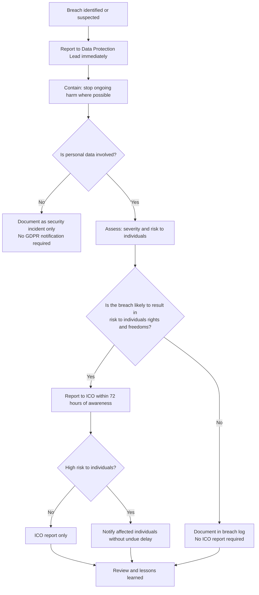

# Data Breach Response Procedure

**Forgotten Felines Cat Rescue — Charity No. 1181190**

---

## Purpose

This procedure tells trustees and volunteers exactly what to do when a personal data breach occurs or is suspected.

UK GDPR requires Forgotten Felines to report certain breaches to the Information Commissioner's Office (ICO) **within 72 hours** of becoming aware of them. Acting quickly and correctly protects the people whose data we hold, protects the charity, and keeps us compliant.

**Data Protection Lead:** Sam Mathias  
**Contact:** Via official trustee channels  
**Last Reviewed:** April 2026

---

## What Counts as a Personal Data Breach

A personal data breach is any security incident that affects the **confidentiality, integrity, or availability** of personal data.

**Examples of breaches:**

- Sending an email or message containing personal data to the wrong person
- Sharing an adoption application or home check note in a group chat where it should not be visible
- Loss or theft of a device holding personal data (phone, laptop)
- Posting an identifiable photo without the person's consent
- Unauthorised access to an account containing personal data (eg a hacked email or social media account)
- Accidentally deleting records that are still required under the retention policy
- A volunteer or trustee leaving the charity still holding access to systems or data

If you are unsure whether something counts as a breach, **treat it as one and report it** — the Data Protection Lead will assess it.

---

## Response Overview

---

## Step 1: Identify and Report

**Who acts:** Any trustee or volunteer who becomes aware of a breach.

As soon as you identify or suspect a breach, report it to the **Data Protection Lead** immediately using official trustee channels.

Do not wait to investigate fully before reporting. The 72-hour ICO reporting clock starts **from the moment the charity becomes aware**, not from when the breach was confirmed.

**Tell the Data Protection Lead:**

- What happened (as much as you know)
- When it happened or when you discovered it
- What personal data may be affected
- How many people may be affected
- Any steps you have already taken

---

## Step 2: Contain the Breach

**Who acts:** The person who identified the breach, guided by the Data Protection Lead.

Take immediate steps to stop the breach from getting worse. Do not delay containment while waiting for a full investigation.

**Containment actions (as applicable):**

- Recall or unsend a message or email if the platform allows it
- Ask the unintended recipient to delete the data and confirm they have done so
- Revoke access to a compromised account or system
- Change passwords on affected accounts immediately
- Remove a post or content published in error
- Secure or recover a lost or stolen device

Document every containment action taken and when.

---

## Step 3: Assess the Breach

**Who acts:** Data Protection Lead, with relevant trustees.

Once contained, assess the breach to determine its severity and the risk it poses to individuals.

**Assess the following:**

| Factor | Questions to consider |
|---|---|
| Type of breach | Confidentiality (disclosed to wrong party)? Integrity (data altered)? Availability (data lost/inaccessible)? |
| Nature of data | Is it sensitive or special category data? Does it include financial, health, or safeguarding information? |
| Volume | How many people are affected? How many records? |
| Identifiability | Can individuals be identified from the data? |
| Likely consequences | What harm could result — embarrassment, financial loss, discrimination, safety risk? |
| Vulnerability of those affected | Are children or vulnerable individuals involved? |

Use this assessment to decide whether ICO reporting and/or individual notification is required.

---

## Step 4: Report to the ICO (if required)

**Who acts:** Data Protection Lead.

Report the breach to the ICO **within 72 hours** of the charity first becoming aware of it, if the breach is likely to result in a risk to the rights and freedoms of individuals.

When in doubt, report. It is better to over-report than to miss a mandatory notification.

**How to report:**

Report online at the ICO's self-service portal:

<https://ico.org.uk/for-organisations/report-a-breach/>

**What to include in the ICO report:**

- Description of the nature of the breach
- Categories and approximate number of data subjects affected
- Categories and approximate number of personal data records affected
- Name and contact details of the Data Protection Lead
- Likely consequences of the breach
- Measures taken or proposed to address the breach and mitigate its effects

If you cannot provide all details within 72 hours, submit what you have and provide the remainder as soon as possible. The ICO accepts phased reporting.

**When ICO reporting is NOT required:**

A breach does not need to be reported to the ICO if it is **unlikely to result in a risk** to individuals' rights and freedoms. For example, loss of data that was strongly encrypted with no key exposure. You must still document the breach internally.

---

## Step 5: Notify Affected Individuals (if required)

**Who acts:** Data Protection Lead, with relevant trustees.

Notify affected individuals **without undue delay** if the breach is likely to result in a **high risk** to their rights and freedoms.

**What to tell them:**

- A clear description of what happened
- The name and contact details of the Data Protection Lead
- The likely consequences of the breach
- The steps taken or being taken to address the breach
- What they can do to protect themselves

**How to notify:**

Use direct communication where possible (phone or email). Do not post breach notifications publicly unless direct contact is impossible and a public notice would be more effective.

**When individual notification is NOT required:**

You do not need to notify individuals directly if:

- Appropriate technical measures (eg encryption) were in place and rendered the data unintelligible
- Subsequent measures have been taken to ensure the high risk is unlikely to materialise
- It would involve disproportionate effort — in which case a public communication may be used instead

If in doubt, notify.

---

## Step 6: Document the Breach

**Who acts:** Data Protection Lead.

All breaches must be documented in the **Breach Log**, regardless of whether they are reported to the ICO or not. This is a legal requirement under UK GDPR Article 33(5).

**Record the following for every breach:**

- Date and time the breach occurred (if known)
- Date and time the charity became aware
- Description of the breach
- Categories and volume of data and individuals affected
- Cause of the breach
- Containment actions taken and by whom
- Assessment of risk and severity
- Whether the ICO was notified, and when
- Whether affected individuals were notified, and when
- Any further remediation actions

The Breach Log is maintained by the Data Protection Lead and held securely.

---

## Step 7: Review and Learn

**Who acts:** Data Protection Lead and relevant trustees.

After the breach is resolved, conduct a brief review to understand what happened and prevent recurrence.

**Review questions:**

- What caused the breach?
- Were existing policies or procedures followed?
- Did any procedure fail or prove insufficient?
- What changes are needed to reduce the risk of this happening again?
- Do any training needs arise?

Document findings and any policy or procedure changes made as a result.

---

## Roles and Responsibilities Summary

| Role | Responsibility |
|---|---|
| Any trustee or volunteer | Report any known or suspected breach immediately to the Data Protection Lead |
| Data Protection Lead | Lead the response, assess severity, decide on ICO reporting, notify individuals if required, maintain the Breach Log |
| All trustees | Support containment and cooperate with the investigation |

---

## Key Contacts and Resources

| Resource | Details |
|---|---|
| Data Protection Lead | Sam Mathias — via official trustee channels |
| ICO Breach Report Portal | <https://ico.org.uk/for-organisations/report-a-breach/> |
| ICO Helpline | 0303 123 1113 |
| ICO Guidance on Breach Reporting | <https://ico.org.uk/for-organisations/uk-gdpr-guidance-and-resources/personal-data-breaches/> |

---

## Document Control

| Field | Detail |
|---|---|
| Document title | Data Breach Response Procedure |
| Version | 1.0 |
| Date | April 2026 |
| Owner | Data Protection Lead |
| Review frequency | Annually, or after any breach occurs |

### Related Documents

- [Data Retention Policy](forgotten-felines-data-retention-policy.md)
- [Privacy Notice](forgotten-felines-privacy-notice.md)
- [Record of Processing Activities (ROPA)](forgotten-felines-record-of-processing-activities.md)
- [GDPR Trustee Policy](forgotten-felines-gdpr-trustee-policy.md)
- [GDPR Volunteer Policy](forgotten-felines-gdpr-volunteer-policy.md)
